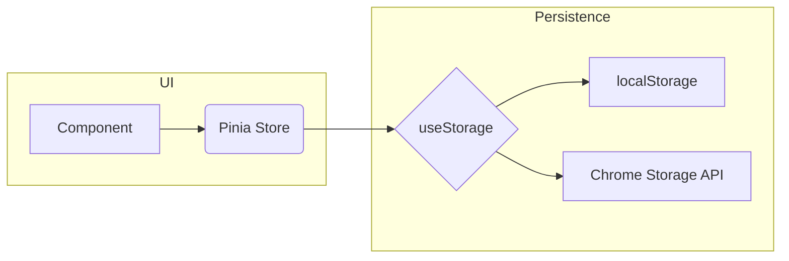

# ⚙️ VibeTab Architecture

## Overview
VibeTab is built as a dual-target application: it can run as a **standalone web app** or as a **Chrome Extension** (New Tab Override).

## Tech Stack

| Layer | Technology |
|-------|-----------|
| Framework | Vue 3 (Composition API) |
| Language | TypeScript |
| Styling | Tailwind CSS |
| State | Pinia |
| Build | Vite + CRXJS |
| Storage | localStorage + IndexedDB + Chrome Storage API |

---

## Directory Structure

```
src/
├── components/           # UI Components
│   ├── Base/             # Primitives (Button, Toggle, Input)
│   ├── Effects/          # Visual effects (Background, Toast, Loading)
│   ├── Layout/           # Structural (TopBar, Grid, SettingsPanel, Footer)
│   └── Widgets/          # Feature widgets (Clock, Search, Weather, etc.)
├── composables/          # Reusable logic (useStorage, useCommandPalette)
├── stores/               # Pinia stores (ui, grid, settings, theme, commandPalette)
├── services/             # External integrations (IndexedDB, Chrome APIs)
├── utils/                # Helpers (WidgetFactory)
├── constants/            # Static data (colors, theme definitions)
├── App.vue               # Application shell
├── main.ts               # Entry point
└── manifest.ts           # Chrome Extension Manifest V3
```

---

## Design Patterns

### 1. **Factory Pattern** (`WidgetFactory`)
Decouples widget type resolution from the Grid component. Adding a new widget only requires registering it in the factory.

### 2. **Composable Pattern** (`useStorage`, `useCommandPalette`)
Encapsulates reusable reactive logic following Vue 3 best practices.

### 3. **Store Pattern** (Pinia)
Centralized state management with persistence via `useStorage` composable.

---

## Build Targets

### Web App Build
```bash
# Development
npm run dev

# Production (outputs to /dist)
npm run build
```
The output in `/dist` is a standard SPA that can be deployed to any static host (Vercel, Netlify, GitHub Pages).

### Chrome Extension Build
The same `npm run build` command produces a Manifest V3 compatible extension.

**To load in Chrome:**
1. Navigate to `chrome://extensions`
2. Enable **Developer Mode** (toggle in top right)
3. Click **Load Unpacked**
4. Select the `/dist` folder

The extension will override the New Tab page.

---

## Data Flow



---

## Future Considerations

- **Background Services**: Implement a Service Worker for background sync (e.g., weather pre-fetch).
- **Chrome Sync**: Migrate `useStorage` to use `chrome.storage.sync` for cross-device settings.
- **Drag & Drop**: Implement a full drag-and-drop grid using CSS Grid or a library like `vue-grid-layout`.

---

© 2025 SabiOfVibe Lab.
